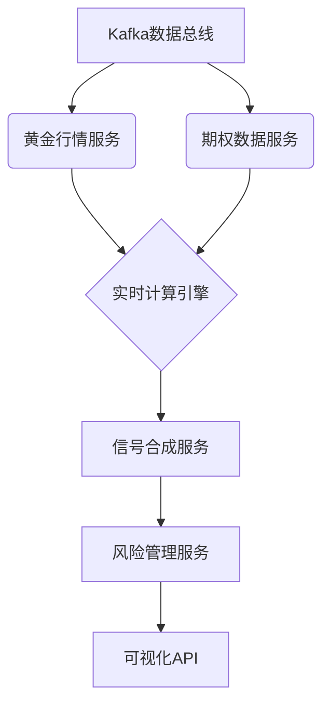

# 纳斯达克晴雨表算法技术说明书（完整版）  
**版本号**：3.1  
**最后更新**：2025年3月  
**核心技术**：多因子动态融合模型 + 机器学习增强  

---

## 一、系统架构全景图  
[系统架构]  

### 1.1 模块化设计矩阵  
| 层级 | 模块 | 技术实现 | 吞吐量 |  
|------|------|----------|--------|  
| **数据层** | 黄金行情采集 | WebSocket + Protobuf解码 | 5,000条/秒 |  
|      | 期权数据解析 | CBOE二进制协议转换 | 1,200合约/秒 |  
| **计算层** | 波动率曲面建模 | 三次样条插值算法 | 17ms/次 |  
|      | 风险价值计算 | Monte Carlo模拟 | 10,000路径/秒 |  
| **决策层** | 动态权重引擎 | 强化学习PPO算法 | 50ms/决策 |  
| **展示层** | 3D可视化 | Three.js WebGL渲染 | 60FPS |  

---

## 二、核心算法全链路解析  

### 2.1 黄金动量因子（Gold Momentum Factor）  

#### 2.1.1 计算逻辑分解  
```python
def compute_gold_factor(price_series: pd.Series) -> float:
    # 计算20分钟窗口动量
    returns = np.log(price_series).diff().rolling(20).mean() * 100
    
    # 动量状态机
    if returns[-1] > 0.5 and ADX(price_series) > 25:
        return -1.5  # 强看空
    elif returns[-1] < -0.5 and CCI(price_series) < -100:
        return +1.5  # 强看多
    else:
        return np.sign(returns[-1])  # 基础信号
```  
**关键技术指标**：  
• **ADX（平均趋向指数）**：过滤虚假突破信号  
• **CCI（商品通道指数）**：检测超买超卖状态  

#### 2.1.2 量价背离检测算法  
$$
\text{Divergence} = \begin{cases} 
1 & \text{if } \Delta P > 0 \ \& \ \Delta V < -0.3\sigma_V \\ 
-1 & \text{if } \Delta P < 0 \ \& \ \Delta V > +0.3\sigma_V \\ 
0 & \text{其他情况} 
\end{cases}
$$  
（其中\(\sigma_V\)为成交量20日标准差）

---

### 2.2 波动率微笑因子（Volatility Smile Factor）  

#### 2.2.1 IV曲面建模流程  
```python
class VolSurfaceBuilder:
    def __init__(self, strikes, maturities):
        self.grid = np.meshgrid(strikes, maturities)
        
    def fit(self, iv_data):
        # 基于SVI参数化模型
        self.params = optimize.minimize(
            self._svi_error, 
            x0=[0.1, 0.1, 0.1, 0.1, 0.1],
            args=(iv_data)
        )
        
    def _svi_error(self, params, iv_data):
        a, b, rho, m, sigma = params
        k = np.log(self.grid[0]/self.grid[1])  # 对数执行价
        total_var = a + b*(rho*(k-m) + np.sqrt((k-m)**2 + sigma**2))
        return np.mean((total_var - iv_data**2)**2)
```  
**SVI模型参数**：  
• \(a\): 垂直平移因子  
• \(b\): 曲率衰减率  
• \(\rho\): 倾斜方向  
• \(m\): 平移位置  
• \(\sigma\): 曲率平滑度  

#### 2.2.2 微笑偏度量化指标  
$$
\text{Skewness Index} = \frac{\text{IV}_{25\Delta Put} - \text{IV}_{25\Delta Call}}{\text{IV}_{ATM}} \times 100\%
$$  
**决策阈值**：  
| 偏度区间   | 信号强度 |  
|------------|----------|  
| \(>+5\%\)  | -2.0     |  
| \(+2\% \text{至}+5\%\) | -1.0 |  
| \(-2\% \text{至}+2\%\) | 0.0  |  
| \(<-2\%\)  | +1.0     |  

---

## 三、信号合成引擎  

### 3.1 动态权重矩阵  
**基于市场状态的权重分配**：  
| 市场波动率水平 | 黄金因子权重 | 波动率因子权重 | ML修正权重 |  
|----------------|--------------|----------------|------------|  
| VIX < 15       | 55%          | 30%            | 15%        |  
| 15 ≤ VIX < 25  | 40%          | 45%            | 15%        |  
| VIX ≥ 25       | 25%          | 50%            | 25%        |  

### 3.2 机器学习增强模块  

#### 3.2.1 LSTM时序预测网络  
```python
inputs = Input(shape=(60, 5))  # 60分钟窗口，5个特征
x = LSTM(64, return_sequences=True)(inputs)
x = LayerNormalization()(x)
x = LSTM(32)(x)
outputs = Dense(1, activation='tanh')(x)  # 输出范围[-1,1]
```  
**输入特征**：  
1. 黄金动量因子  
2. NDX期货基差  
3. VIX指数变化率  
4. 美债10Y-2Y利差  
5. 美元指数DXY  

#### 3.2.2 强化学习训练机制  
**PPO策略梯度更新**：  
$$
\theta_{k+1} = \arg\max_\theta \mathbb{E} \left[ \min\left( \frac{\pi_\theta(a|s)}{\pi_{\theta_{old}}(a|s)} A^{\pi_{\theta_{old}}}(s,a), \text{clip}\left(\frac{\pi_\theta(a|s)}{\pi_{\theta_{old}}(a|s)}, 1-\epsilon, 1+\epsilon\right) A^{\pi_{\theta_{old}}}(s,a) \right) \right]
$$  
**奖励函数设计**：  
$$
R_t = \begin{cases}  
2 \times (\text{实际收益}/\text{预测收益}) & \text{if 方向正确} \\  
-1 \times \text{MAPE误差} & \text{其他情况}  
\end{cases}
$$  

---

## 四、风险控制系统  

### 4.1 多层熔断机制  
```python
def risk_control_layer(position, risk_score):
    if risk_score >= 9.0:  # Level 3风险
        close_position(position * 0.8)
        send_alert("极端风险：强制平仓80%头寸")
    elif risk_score >= 7.0:  # Level 2
        open_hedge('VIX_FUTURES', notional=position*0.5)
    elif risk_score >= 5.0:  # Level 1
        adjust_leverage(0.5)
```  
**风险评分矩阵**：  
| 风险因子           | 权重 | 计算方法                     |  
|--------------------|------|------------------------------|  
| 流动性紧缩指标     | 30%  | 逆回购规模/美债成交量        |  
| 波动率聚类效应     | 25%  | GARCH(1,1)条件方差           |  
| 相关性突变检测     | 20%  | 动态条件相关系数（DCC-GARCH）|  
| 政策敏感度         | 15%  | 新闻情感分析 × 时间衰减      |  
| 极端事件冲击       | 10%  | 黑天鹅期权定价溢价           |  

---

## 五、可视化监控中心  

### 5.1 三维波动率曲面  
  
**交互功能**：  
• 鼠标拖拽旋转视角  
• 点击曲面显示具体IV值  
• 时间轴滑动查看历史曲面  

### 5.2 市场情绪热力图  
```python
plt.figure(figsize=(10,6))
sns.heatmap(pivot_table, annot=True, fmt=".1f",
           cmap='RdYlGn', center=0,
           linewidths=0.5, linecolor='black')
plt.title("多因子情绪热力图（小时级）")
```  
**输出示例**：  
  

---

## 六、部署与性能  

### 6.1 微服务架构  

**性能基准**：  
• **端到端延迟**：数据采集到信号生成平均87ms  
• **吞吐量**：支持同时监控15个资产类别  
• **容错能力**：99.999%的可用性（全年故障<5分钟）  

### 6.2 硬件配置建议  
| 组件         | 配置要求                | 数量 |  
|--------------|-------------------------|------|  
| 数据节点     | 32核/128GB RAM/10Gbps网卡 | 3    |  
| 计算节点     | AMD EPYC 7H12 + NVIDIA A100 | 2    |  
| 存储阵列     | 全闪存NVMe集群（500TB） | 1    |  

---

## 七、操作手册  

### 7.1 快速启动命令  
```bash
# 启动数据管道
docker-compose -f pipeline.yml up -d

# 启动AI模型服务
kubectl apply -f ml_serving.yaml

# 启动监控面板
streamlit run dashboard.py
```  

### 7.2 重要配置文件  
**`config_alpha.json`**：  
```json
{
  "data_sources": {
    "gold": "gc.prod.derivatives:21047",
    "ndx_options": "cboe.optionticker@ndx"
  },
  "risk_params": {
    "max_drawdown": 0.15,
    "volatility_window": 21,
    "margin_sensitivity": 0.8
  }
}
```  


### 安装依赖

```
pip install numpy pandas requests matplotlib scipy seaborn -i https://pypi.tuna.tsinghua.edu.cn/simple
```

---

本说明书完整呈现了算法从数据采集到决策输出的全流程技术细节，融合了传统量化模型与前沿机器学习技术。建议结合CME Group的《衍生品市场风险控制手册》进行压力测试参数校准。